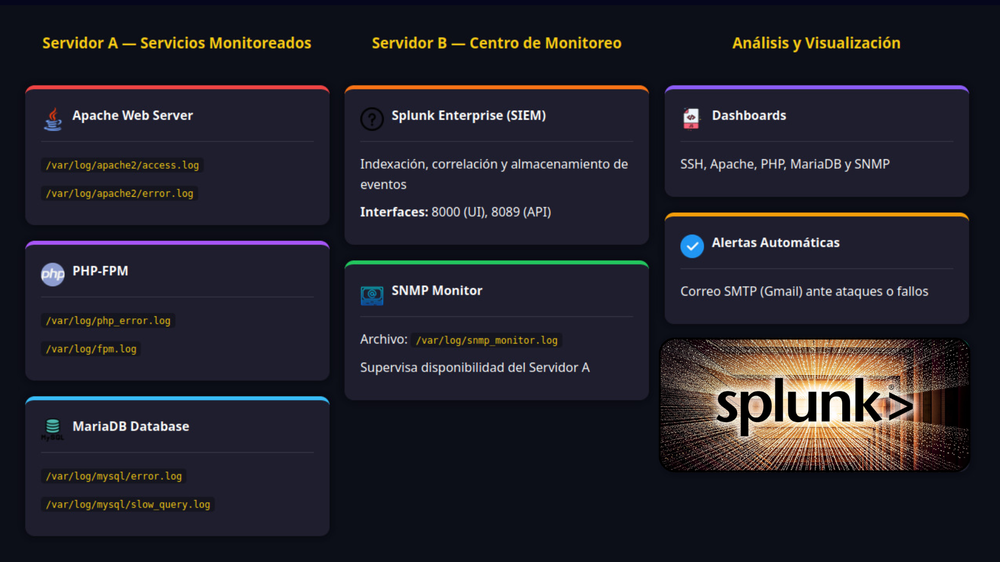
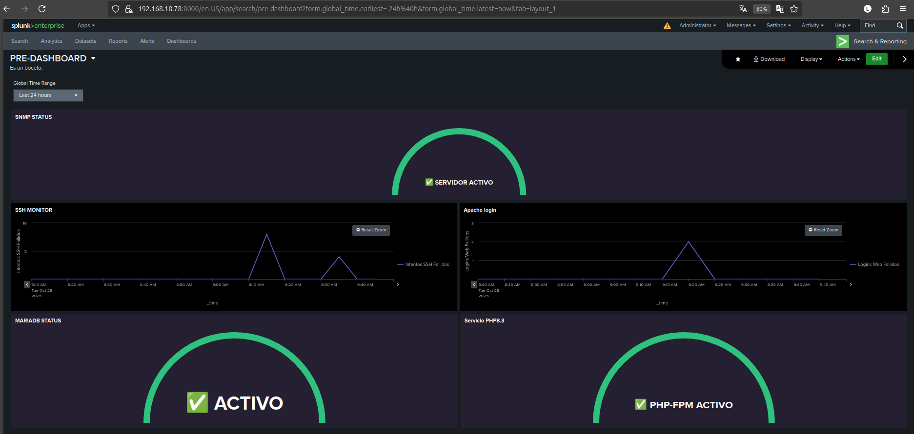
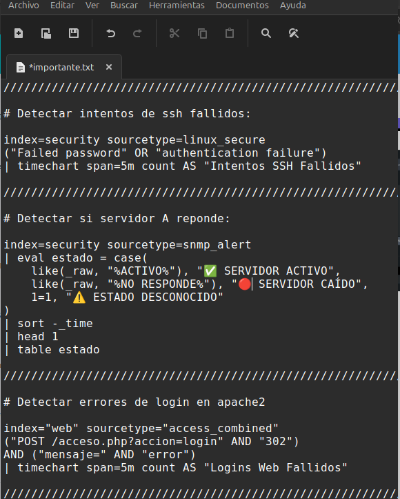
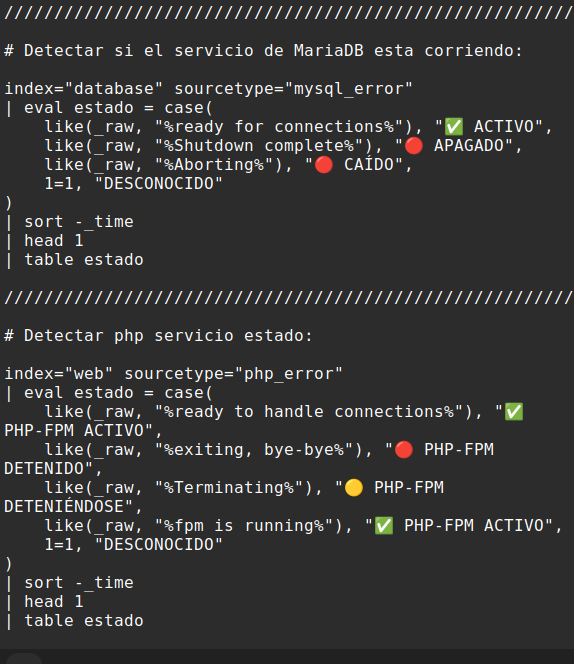
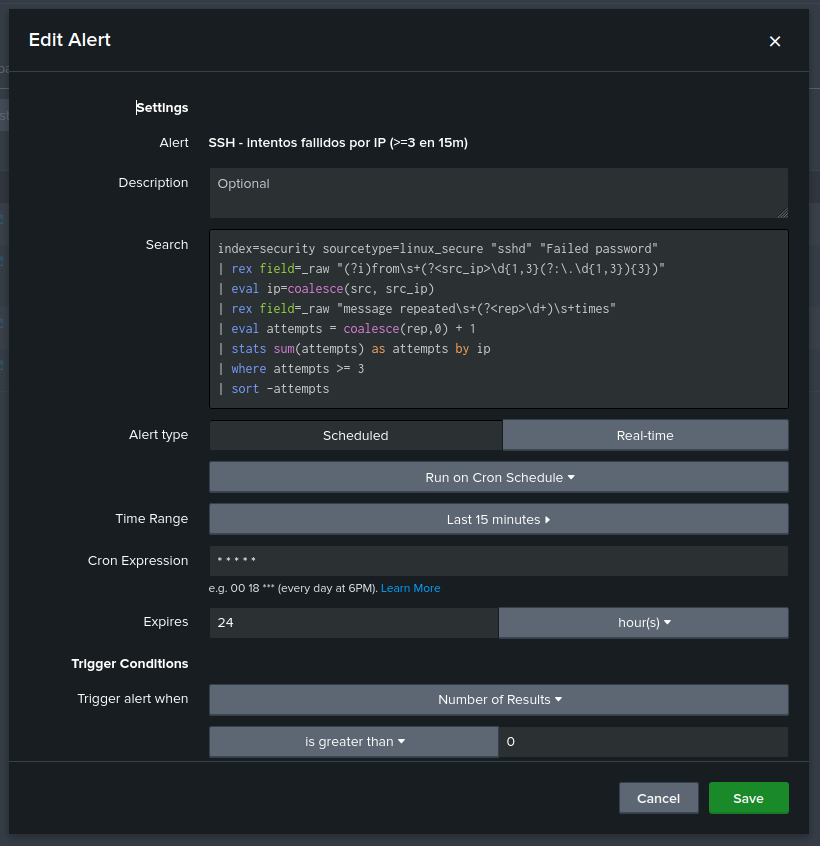
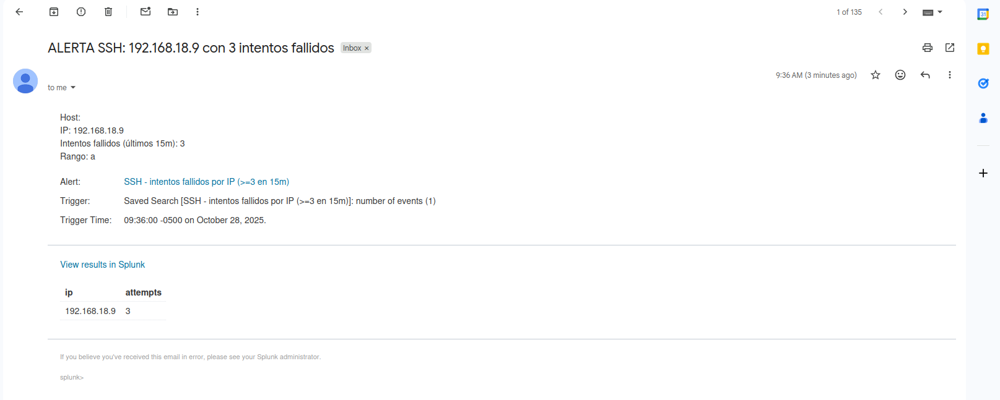

# 🔐 Splunk SIEM Project

Sistema de monitoreo y detección de eventos de seguridad implementado con **Splunk Enterprise** sobre un entorno Linux de dos servidores.

---

## 📌 Descripción

Este proyecto implementa un **SIEM (Security Information and Event Management)** utilizando Splunk para el monitoreo en tiempo real, correlación de logs y generación de alertas automáticas ante eventos de seguridad críticos.

Entre sus principales capacidades se encuentran:

- Detección de **ataques de fuerza bruta SSH** mediante análisis de intentos fallidos de autenticación
- Supervisión del estado de servicios críticos: **Apache**, **MariaDB** y **PHP-FPM**
- Monitoreo de disponibilidad del servidor mediante **SNMP**
- **Alertas automáticas por correo (Gmail/SMTP)** ante eventos sospechosos
- **Dashboards interactivos** con visualización en tiempo real de todos los servicios

---

## 🧱 Arquitectura del Sistema

El entorno se compone de dos servidores con roles diferenciados:

| Componente | Descripción |
|---|---|
| **Servidor A** | Servidor monitoreado (Apache, PHP-FPM, MariaDB) |
| **Servidor B** | Centro de monitoreo con Splunk Enterprise (SIEM) |
| **SNMP Monitor** | Supervisa la disponibilidad del Servidor A |
| **Dashboards** | Visualización de SSH, Apache, PHP, MariaDB y SNMP |
| **Alertas Automáticas** | Notificaciones por correo SMTP ante ataques o fallos |



### Logs monitoreados en Servidor A

| Servicio | Archivos de log |
|---|---|
| Apache Web Server | `/var/log/apache2/access.log`, `/var/log/apache2/error.log` |
| PHP-FPM | `/var/log/php_error.log`, `/var/log/fpm.log` |
| MariaDB | `/var/log/mysql/error.log`, `/var/log/mysql/slow_query.log` |
| SNMP Monitor | `/var/log/snmp_monitor.log` |

---

## 🛠️ Tecnologías utilizadas

- [Splunk Enterprise](https://www.splunk.com/) — SIEM (indexación, correlación y almacenamiento de eventos)
- **Linux** — Sistema operativo del entorno monitoreado
- **SSH / OpenSSH** — Servicio monitoreado para detección de fuerza bruta
- **Apache2** — Servidor web monitoreado
- **MariaDB (MySQL)** — Base de datos monitoreada
- **PHP-FPM 8.3** — Servicio PHP monitoreado
- **SNMP** — Protocolo para monitoreo de disponibilidad
- **Gmail SMTP** — Canal de alertas por correo electrónico
- **SPL** (Search Processing Language) — Lenguaje de queries de Splunk

---

## 📊 Dashboard

El dashboard **PRE-DASHBOARD** centraliza la visibilidad del entorno en tiempo real con los siguientes paneles:

| Panel | Descripción |
|---|---|
| **SNMP Status** | Estado de disponibilidad del Servidor A (✅ ACTIVO / 🔴 CAÍDO) |
| **SSH Monitor** | Gráfico temporal de intentos SSH fallidos |
| **Apache Login** | Gráfico temporal de logins web fallidos |
| **MariaDB Status** | Estado del servicio MariaDB (✅ ACTIVO / 🔴 APAGADO) |
| **Servicio PHP8.3** | Estado del servicio PHP-FPM (✅ PHP-FPM ACTIVO / 🔴 DETENIDO) |



---

## 🔍 Queries SPL

Las queries personalizadas se encuentran en la carpeta [`queries/`](queries/) y son la base tanto del dashboard como del sistema de alertas.

### Query 1 — Detección de intentos SSH fallidos

```spl
index=security sourcetype=linux_secure
("Failed password" OR "authentication failure")
| timechart span=5m count AS "Intentos SSH Fallidos"
```

### Query 2 — Estado del Servidor A (SNMP)

```spl
index=security sourcetype=snmp_alert
| eval estado = case(
    like(_raw, "%ACTIVO%"), "✅ SERVIDOR ACTIVO",
    like(_raw, "%NO RESPONDE%"), "🔴 SERVIDOR CAÍDO",
    1=1, "⚠️ ESTADO DESCONOCIDO"
)
| sort -_time
| head 1
| table estado
```

### Query 3 — Errores de login en Apache

```spl
index="web" sourcetype="access_combined"
("POST /acceso.php?accion=login" AND "302")
AND ("mensaje=" AND "error")
| timechart span=5m count AS "Logins Web Fallidos"
```

### Query 4 — Estado de MariaDB

```spl
index="database" sourcetype="mysql_error"
| eval estado = case(
    like(_raw, "%ready for connections%"), "✅ ACTIVO",
    like(_raw, "%Shutdown complete%"), "🔴 APAGADO",
    like(_raw, "%Aborting%"), "🔴 CAÍDO",
    1=1, "DESCONOCIDO"
)
| sort -_time
| head 1
| table estado
```

### Query 5 — Estado de PHP-FPM

```spl
index="web" sourcetype="php_error"
| eval estado = case(
    like(_raw, "%ready to handle connections%"), "✅ PHP-FPM ACTIVO",
    like(_raw, "%exiting, bye-bye%"), "🔴 PHP-FPM DETENIDO",
    like(_raw, "%Terminating%"), "🟡 PHP-FPM DETENIÉNDOSE",
    like(_raw, "%fpm is running%"), "✅ PHP-FPM ACTIVO",
    1=1, "DESCONOCIDO"
)
| sort -_time
| head 1
| table estado
```

### Query 6 — Alerta de fuerza bruta SSH (usada en la alerta Gmail)

Disponible en [`queries/alert_gmail.spl`](queries/alert_gmail.spl)

```spl
index=security sourcetype=linux_secure "sshd" "Failed password"
| rex field=_raw "(?i)from\s+(?<src_ip>\d{1,3}(?:\.\d{1,3}){3})"
| eval ip=coalesce(src, src_ip)
| rex field=_raw "message repeated\s+(?<rep>\d+)\s+times"
| eval attempts = coalesce(rep,0) + 1
| stats sum(attempts) as attempts by ip
| where attempts >= 3
| sort -attempts
```

**Vista de las queries en el editor de TEXTO:**




---

## 🚨 Sistema de Alertas

Se configuró una alerta de tipo **Real-time** en Splunk que se activa cuando una IP registra **3 o más intentos fallidos de SSH en los últimos 15 minutos**.

### Configuración de la alerta

| Parámetro | Valor |
|---|---|
| **Nombre** | SSH - intentos fallidos por IP (>=3 en 15m) |
| **Tipo** | Real-time (Cron `* * * * *`) |
| **Ventana de tiempo** | Últimos 15 minutos |
| **Condición de disparo** | Número de resultados > 0 |
| **Expiración** | 24 horas |
| **Acción** | Envío de correo vía Gmail SMTP |

**Vista de configuración de la alerta en Splunk:**



### Correo de alerta recibido

El correo incluye la IP atacante, el número de intentos fallidos detectados y un enlace directo a los resultados en Splunk.



> **Ejemplo real:** IP `192.168.18.9` con 3 intentos fallidos detectados a las 09:36 AM — alerta disparada y correo recibido 3 minutos después.

---

## 📁 Estructura del repositorio

```
Splunk-SIEM-Project/
├── docs/
│   └── arquitectura.png         # Diagrama de arquitectura del sistema
├── images/
│   ├── dashboard.png             # Vista del dashboard principal
│   ├── alert-email.png           # Correo de alerta recibido
│   ├── query_alert_gmail.png     # Configuración de la alerta en Splunk
│   ├── query_dashbord_01.png     # Queries SSH, SNMP y Apache
│   └── query_dashbord_02.png     # Queries MariaDB y PHP-FPM
├── queries/
│   └── alert_gmail.spl           # Query SPL de la alerta principal
└── README.md
```

---

## ✅ Funcionalidades implementadas

- [x] Ingesta de logs desde múltiples fuentes (SSH, Apache, PHP, MariaDB, SNMP)
- [x] Detección de ataques de fuerza bruta SSH
- [x] Monitoreo de estado de servicios críticos en tiempo real
- [x] Dashboard interactivo con paneles por servicio
- [x] Sistema de alertas automáticas por correo (Gmail)
- [x] Queries SPL personalizadas para cada fuente de datos
- [x] Arquitectura de dos servidores (monitoreado + SIEM)